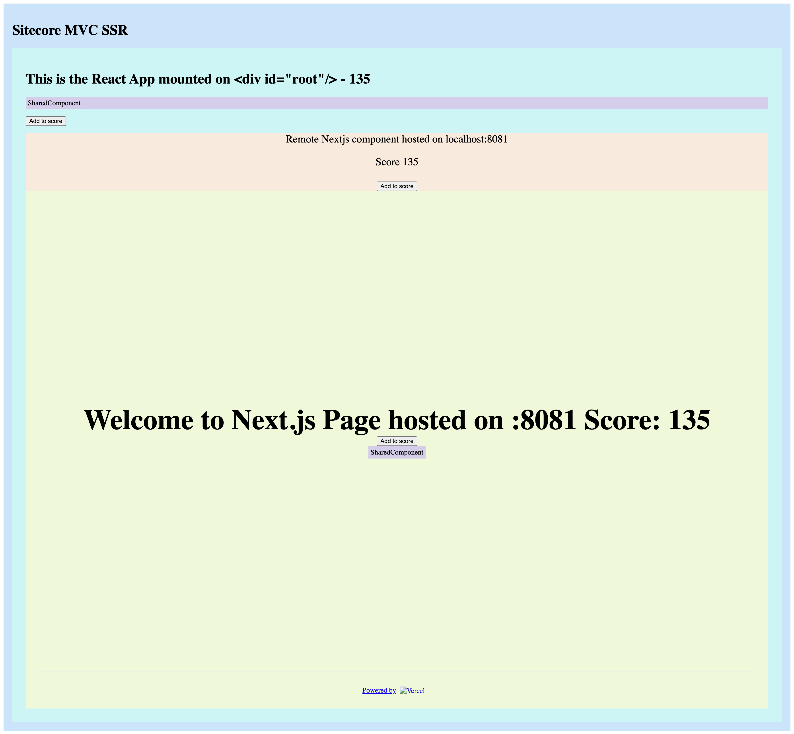

# Module federation example

## Content
* host -> React Client side host app
* remote -> Next.js remote app. This one exposes a page, a component and a function (store)
* ui -> Shared UI library (no federation)

## How to run this example
* `yarn`
* `yarn start`

## Disclaimer
This is not intented for production use. Things missing: typescript, turborepo, HMR on remote resources.

## Screenshot
